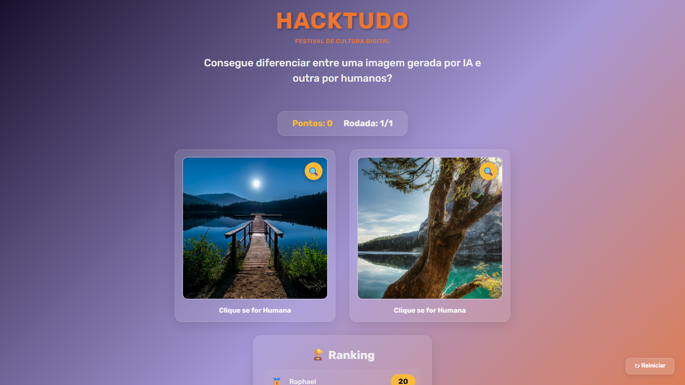
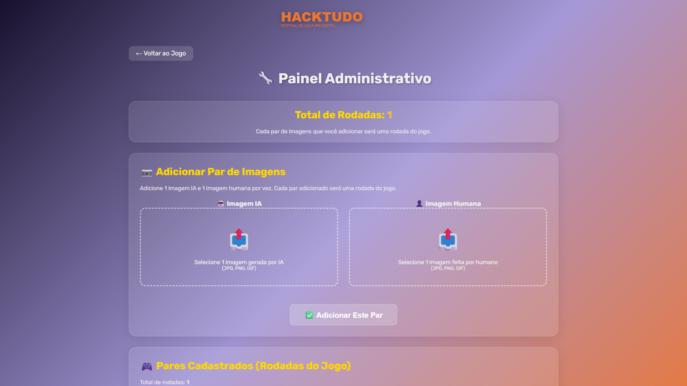

# 🎮 HackSense 2025 - AI vs Human Image Game

<div align="center">



**Consegue diferenciar entre uma imagem gerada por IA e outra por humanos?**

Um jogo interativo desenvolvido para o **HackTudo 2025** - Festival de Cultura Digital

[](https://opensource.org/licenses/MIT)
[](https://nodejs.org)
[](https://reactjs.org)

[🎮 Demo](#como-jogar) • [📦 Instalação](#instalação) • [⚙️ Admin](#painel-administrativo) • [🛠️ Tecnologias](#tecnologias)

</div>

---

## 📖 Sobre o Projeto

HackSense é uma aplicação web interativa que desafia jogadores a identificarem se imagens foram geradas por Inteligência Artificial ou criadas por humanos. Desenvolvido com as cores e identidade visual oficial do HackTudo, o jogo combina educação tecnológica com entretenimento.

### ✨ Características Principais

- 🎨 **Visual Identity HackTudo** - Design com gradiente roxo → laranja e tipografia oficial
- 🔍 **Visualização em Tela Cheia** - Analise imagens em fullscreen com um clique
- 🎉 **Feedback Interativo** - Animações com confetti e feedback visual imediato
- 🏆 **Sistema de Ranking** - Placar de líderes com pontuação persistente
- 📱 **Design Responsivo** - Glassmorphism adaptado para todos os dispositivos
- ⚡ **Upload por Pares** - Sistema administrativo para gerenciar rodadas do jogo

---

## 🚀 Instalação

### Pré-requisitos

- **Node.js** 20.x ou superior
- **npm** ou **yarn**

### Passo a Passo

```bash
# Clone o repositório
git clone git@github.com:raphaelbgr/HackSense2025.git
cd HackSense2025

# Instale as dependências
npm install

# Inicie o servidor de desenvolvimento
npm run dev

# Acesse http://localhost:4111
```

---

## 🎮 Como Jogar

1. **Compare as Imagens** - Duas imagens aparecem lado a lado
2. **Clique na Humana** - Identifique qual foi criada por um humano
3. **Ganhe Pontos** - +10 pontos por acerto ✅
4. **Analise em Fullscreen** - Use o botão 🔍 para ampliar
5. **Entre no Ranking** - Salve sua pontuação ao final

### Sistema de Pontuação

- ✅ **Acerto:** +10 pontos + animação de confetti
- ❌ **Erro:** Feedback visual vermelho
- 🏆 **Ranking:** Top 10 jogadores salvos

---

## ⚙️ Painel Administrativo



Acesse `/admin` para gerenciar o jogo:

### Funcionalidades Admin

- **Upload de Pares** - Adicione 1 imagem IA + 1 imagem humana por vez
- **Gestão de Rodadas** - Cada par = 1 rodada do jogo
- **Visualização** - Veja todos os pares cadastrados
- **Deletar Pares** - Remova pares indesejados

### Como Adicionar Imagens

1. Acesse `http://localhost:4111/admin`
2. Selecione uma imagem gerada por IA
3. Selecione uma imagem criada por humano
4. Clique em "Adicionar Este Par"
5. O jogo terá automaticamente X rodadas (X = número de pares)

---

## 🛠️ Tecnologias

### Frontend
- **React 18.3** - Biblioteca UI
- **Vite 5.4** - Build tool e dev server
- **Canvas Confetti** - Animações de celebração
- **CSS3** - Glassmorphism e gradientes
- **Google Fonts** - Rubik (tipografia oficial)

### Backend
- **Node.js 20+** - Runtime JavaScript
- **Express 4.18** - Framework web
- **Multer** - Upload de arquivos
- **JSON** - Armazenamento de dados

### Design System
- **Cores HackTudo:**
  - Laranja Principal: `#ed752f`
  - Amarelo: `#f9bb37`
  - Verde: `#5dbf4a`
  - Vermelho: `#d94141`
  - Roxo Escuro: `#17112d`
  - Roxo Claro: `#A598D7`

---

## 📁 Estrutura do Projeto

```
HackSense2025/
├── data/
│   ├── images.json          # Metadados dos pares
│   ├── rankings.json        # Placar de líderes
│   └── config.json          # Configurações do jogo
├── public/
│   ├── images/
│   │   ├── ai/             # Imagens geradas por IA
│   │   └── human/          # Imagens humanas
│   ├── admin.html          # Interface administrativa
│   └── hacktudo-logo.svg   # Logo oficial
├── src/
│   ├── App.jsx             # Componente principal
│   ├── App.css             # Estilos e animações
│   └── main.jsx            # Entry point React
├── server-dev.js           # Servidor desenvolvimento
├── server.js               # Servidor produção
├── vite.config.js          # Configuração Vite
└── package.json            # Dependências
```

---

## 📝 API Endpoints

| Método | Endpoint | Descrição |
|--------|----------|-----------|
| `GET` | `/api/pair` | Retorna par aleatório de imagens |
| `POST` | `/api/check` | Verifica se resposta está correta |
| `GET` | `/api/rankings` | Retorna top 10 do ranking |
| `POST` | `/api/score` | Salva pontuação no ranking |
| `GET` | `/api/admin/pairs` | Lista todos os pares cadastrados |
| `POST` | `/api/admin/upload/pair` | Upload de novo par de imagens |
| `DELETE` | `/api/admin/image/:id` | Remove imagem específica |

---

## 🔧 Scripts Disponíveis

```bash
# Desenvolvimento (hot-reload)
npm run dev

# Build de produção
npm run build

# Servidor produção (após build)
npm start
```

---

## 🎨 Visual Identity

O projeto utiliza a identidade visual oficial do **HackTudo - Festival de Cultura Digital**:

- **Tipografia:** Rubik (Google Fonts)
- **Efeito Visual:** Glassmorphism (vidro líquido)
- **Gradiente:** Dark Purple → Purple → Orange
- **Logo:** HACKTUDO em laranja (#ed752f)

---

## 📄 Licença

Este projeto foi desenvolvido para o **HackTudo 2025** - Festival de Cultura Digital.

---

## 🤝 Contribuindo

Contribuições são bem-vindas! Sinta-se à vontade para:

1. Fazer fork do projeto
2. Criar uma branch (`git checkout -b feature/NovaFeature`)
3. Commit suas mudanças (`git commit -m 'Add: nova feature'`)
4. Push para a branch (`git push origin feature/NovaFeature`)
5. Abrir um Pull Request

---

## 👥 Autores

Desenvolvido com ❤️ para o **HackTudo 2025**

🤖 *Generated with [Claude Code](https://claude.com/claude-code)*

---

<div align="center">

**[⬆ Voltar ao topo](#-hacksense-2025---ai-vs-human-image-game)**

</div>
