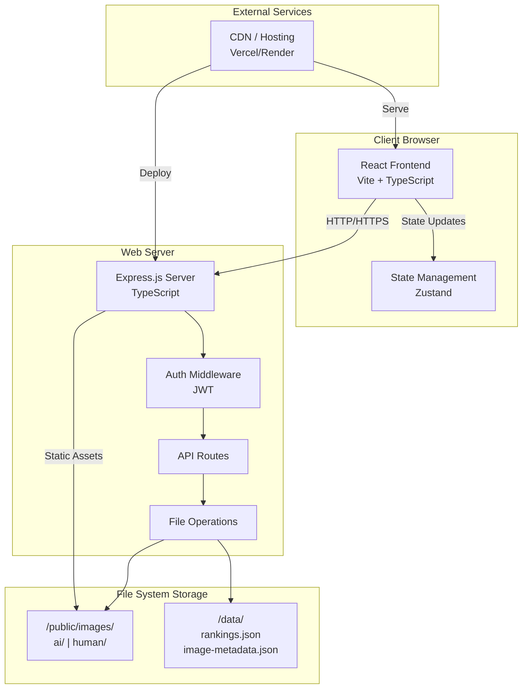
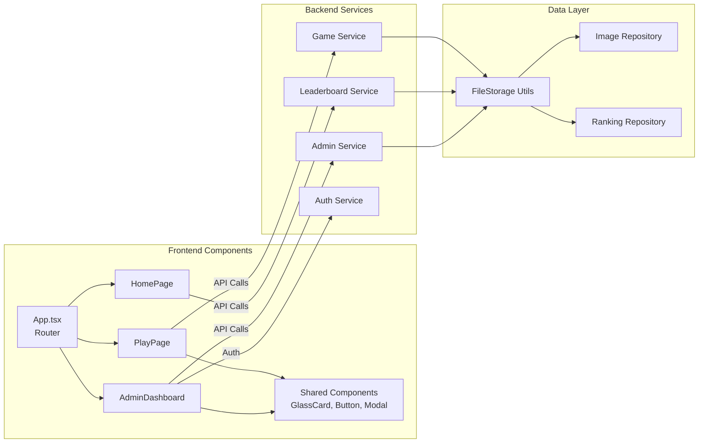
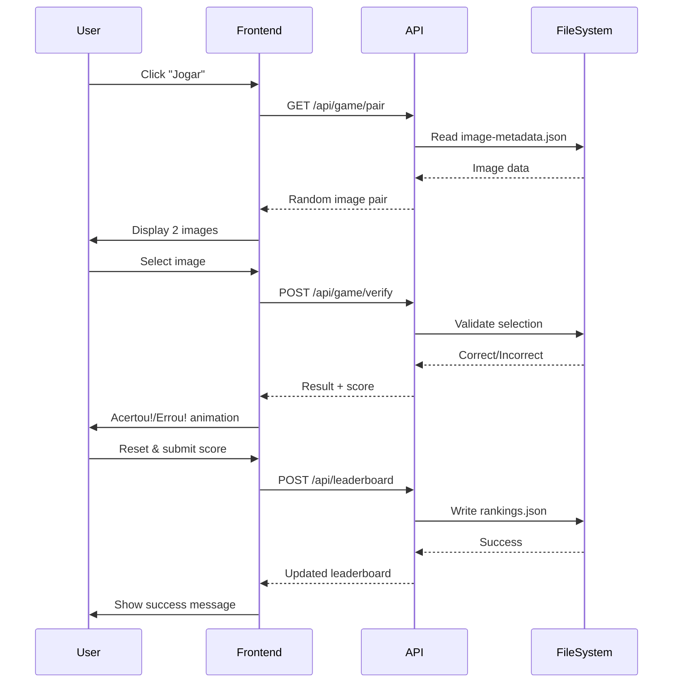
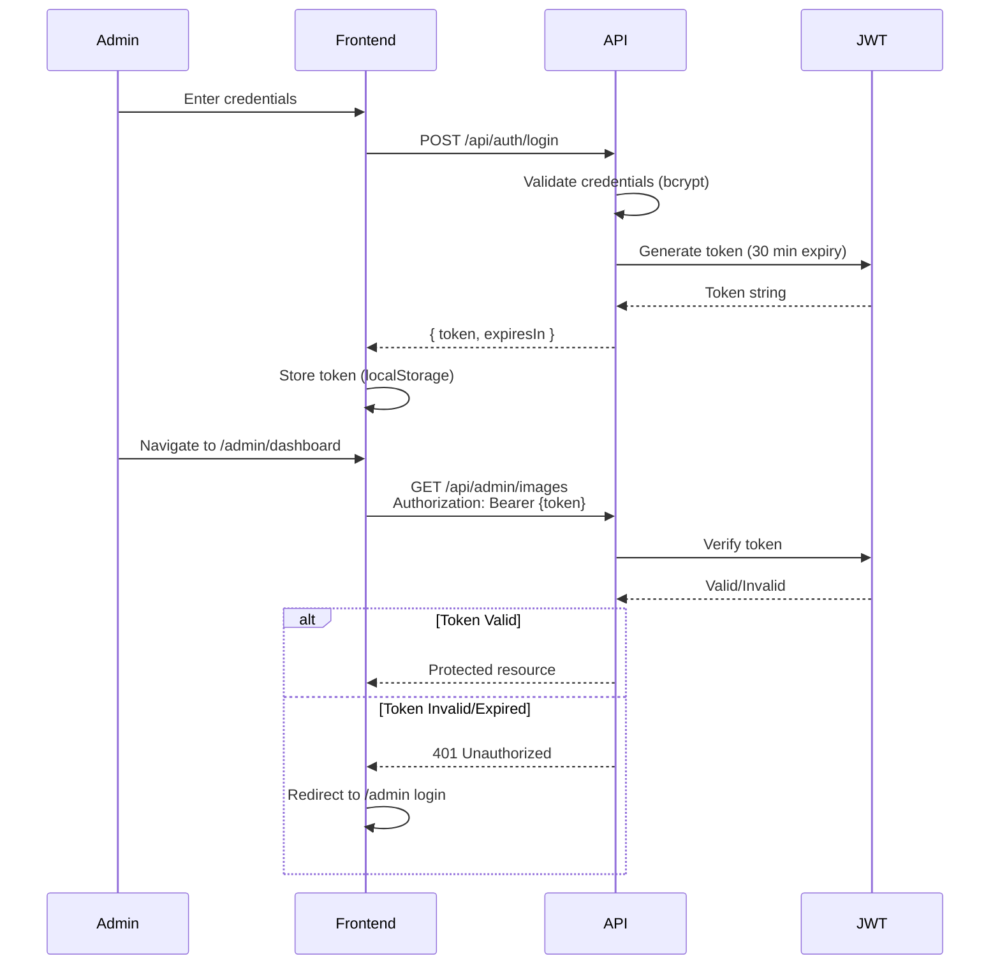

# AI vs Human Image Challenge - Technical Architecture Document

**Version:** 1.0
**Last Updated:** 2025-09-30
**Author:** Technical Architecture Team
**Status:** Draft - Ready for Review

---

## Table of Contents

1. [Executive Summary](#executive-summary)
2. [System Architecture Overview](#system-architecture-overview)
3. [Technology Stack](#technology-stack)
4. [Data Models & Storage](#data-models--storage)
5. [API Design](#api-design)
6. [Frontend Architecture](#frontend-architecture)
7. [Authentication & Authorization](#authentication--authorization)
8. [File Storage & Management](#file-storage--management)
9. [State Management](#state-management)
10. [Deployment Architecture](#deployment-architecture)
11. [Testing Strategy](#testing-strategy)
12. [Performance Optimization](#performance-optimization)
13. [Security Considerations](#security-considerations)
14. [Technical Debt & Future Considerations](#technical-debt--future-considerations)

---

## Executive Summary

The AI vs Human Image Challenge is a web-based gamified application where users test their ability to distinguish AI-generated images from human-created ones. The system follows a **monolithic architecture** with clear frontend/backend separation, file-based data persistence, and a liquid glass (glassmorphism) design aesthetic.

**Architecture Philosophy:**
- **Simplicity First:** File-based storage eliminates database complexity for MVP
- **Scalability Path:** Modular design enables future migration to database and microservices
- **Developer Experience:** Modern tooling (TypeScript, Vite, React) for fast iteration
- **User Experience:** 60fps animations, sub-2s load times, WCAG AA accessibility

**Key Architectural Decisions:**
- Monorepo structure for unified codebase
- React + Vite for frontend (fast HMR, modern defaults)
- Express.js for backend (minimal, flexible)
- JSON file storage for MVP (rankings, image metadata)
- JWT-based authentication for admin
- Liquid glass design system with HackTudo branding

---

## System Architecture Overview

### High-Level Architecture Diagram



### Component-Level Architecture



### Data Flow Diagram



---

## Technology Stack

### Frontend Stack

| Technology | Version | Purpose | Rationale |
|------------|---------|---------|-----------|
| **React** | 18.3.x | UI Framework | Industry standard, component-based, excellent ecosystem |
| **Vite** | 5.x | Build Tool | Fast HMR, modern ES modules, optimized builds |
| **TypeScript** | 5.3.x | Type Safety | Catch errors at compile-time, better DX, self-documenting |
| **React Router** | 6.x | Client Routing | Declarative routing, code splitting support |
| **Zustand** | 4.x | State Management | Lightweight (3KB), simple API, TypeScript-first |
| **Framer Motion** | 11.x | Animations | Declarative animations, 60fps performance, gestures |
| **canvas-confetti** | 1.x | Particle Effects | Lightweight confetti for success animations |
| **CSS Modules** | Native | Styling | Scoped styles, no runtime overhead, works with Vite |

### Backend Stack

| Technology | Version | Purpose | Rationale |
|------------|---------|---------|-----------|
| **Node.js** | 20.x LTS | Runtime | Stable LTS, native ESM support, performance |
| **Express.js** | 4.x | Web Framework | Minimal, flexible, battle-tested |
| **TypeScript** | 5.3.x | Type Safety | Shared types with frontend, compile-time safety |
| **Multer** | 1.x | File Upload | Standard middleware for multipart/form-data |
| **Sharp** | 0.33.x | Image Processing | Fast image validation, compression, resizing |
| **bcrypt** | 5.x | Password Hashing | Industry standard, 10+ rounds |
| **jsonwebtoken** | 9.x | JWT Auth | Stateless authentication, industry standard |
| **uuid** | 9.x | Unique IDs | Generate unique image/entry IDs |

### Development Tools

| Tool | Purpose |
|------|---------|
| **Vitest** | Unit/integration testing (Vite-native) |
| **React Testing Library** | Component testing |
| **Playwright** | E2E testing (optional for MVP) |
| **ESLint** | Code linting (TypeScript, React rules) |
| **Prettier** | Code formatting |
| **Husky** | Git hooks (pre-commit linting) |
| **Concurrently** | Run dev servers in parallel |

### Deployment & Infrastructure

| Service | Purpose | Alternative |
|---------|---------|------------|
| **Vercel** (Primary) | Full-stack hosting | Render, Railway |
| **GitHub** | Source control | GitLab, Bitbucket |
| **GitHub Actions** | CI/CD (future) | Vercel auto-deploy |

---

## Data Models & Storage

### Storage Strategy

**MVP:** File-based JSON storage
**Rationale:**
- Eliminates database setup complexity
- Sufficient for <1000 users/day
- Easy to migrate to database later
- No external service dependencies

**Post-MVP Migration Path:** PostgreSQL or MongoDB when scale requires

---

### Data Models (TypeScript Interfaces)

#### Image Metadata Model

```typescript
/**
 * Represents an image in the repository
 * Stored in: /data/image-metadata.json
 */
interface ImageMetadata {
  id: string;                    // UUID v4
  filename: string;               // Unique filename on disk
  type: 'ai' | 'human';          // Image classification
  description?: string;           // Optional description (max 500 chars)
  uploadedAt: string;             // ISO 8601 timestamp
  dimensions: {
    width: number;                // Pixels
    height: number;               // Pixels
  };
  fileSize: number;               // Bytes
  uploader?: string;              // Admin username (future)
}

/**
 * Example:
 * {
 *   "id": "a3f2e9d1-7c4b-4a8e-9f3d-1e6c7b4a5d2f",
 *   "filename": "1730000000000-a3f2e9d1.jpg",
 *   "type": "ai",
 *   "description": "AI-generated landscape with mountains",
 *   "uploadedAt": "2025-09-30T12:00:00.000Z",
 *   "dimensions": { "width": 1024, "height": 768 },
 *   "fileSize": 245678
 * }
 */
```

#### Leaderboard Entry Model

```typescript
/**
 * Represents a leaderboard entry
 * Stored in: /data/rankings.json
 */
interface LeaderboardEntry {
  id: string;                     // UUID v4
  name: string;                   // Player name (max 50 chars)
  email?: string;                 // Optional email
  score: number;                  // Total points (10 per correct answer)
  roundsPlayed: number;           // Number of rounds completed
  timestamp: string;              // ISO 8601 timestamp
  rank?: number;                  // Calculated on GET (not stored)
}

/**
 * Example:
 * {
 *   "id": "b7e8f4c2-9d3a-4b1e-8f7c-2d4e6a9b3f1c",
 *   "name": "Ana Silva",
 *   "email": "ana@example.com",
 *   "score": 180,
 *   "roundsPlayed": 18,
 *   "timestamp": "2025-09-30T14:30:00.000Z"
 * }
 */
```

#### Game State Model (Frontend Only)

```typescript
/**
 * Game state managed by Zustand
 * Not persisted to backend
 */
interface GameState {
  // Current game session
  score: number;                   // Current score
  roundNumber: number;             // Current round (1-indexed)
  currentPair: ImagePair | null;   // Current image pair being displayed
  isAnimating: boolean;            // Animation in progress
  gameStatus: 'ready' | 'selecting' | 'animating';

  // History
  history: HistoryEntry[];         // Session history (max 50)

  // Actions
  addHistoryEntry: (entry: HistoryEntry) => void;
  updateScore: (points: number) => void;
  resetGame: () => void;
  setCurrentPair: (pair: ImagePair) => void;
  setAnimating: (isAnimating: boolean) => void;
}

interface ImagePair {
  pairId: string;                  // UUID for this pair
  imageA: {
    id: string;
    url: string;
    description?: string;
  };
  imageB: {
    id: string;
    url: string;
    description?: string;
  };
  correctId: string;               // ID of AI-generated image (hidden from client)
}

interface HistoryEntry {
  round: number;
  imageA: ImageInfo;
  imageB: ImageInfo;
  selectedId: string;
  correctId: string;
  correct: boolean;
  scoreAwarded: number;
  timestamp: Date;
}
```

#### Admin Session Model

```typescript
/**
 * Admin authentication session
 * Stored in JWT token (not persisted to file)
 */
interface AdminSession {
  username: string;                // Admin username
  iat: number;                     // Issued at (Unix timestamp)
  exp: number;                     // Expires at (Unix timestamp, 30 min)
}

/**
 * Admin credentials (environment variables)
 * ADMIN_USERNAME=admin
 * ADMIN_PASSWORD_HASH=$2b$10$...bcrypt-hash...
 */
```

---

### JSON File Structure

#### /data/image-metadata.json

```json
[
  {
    "id": "uuid-1",
    "filename": "1730000000000-uuid1.jpg",
    "type": "ai",
    "description": "AI-generated mountain landscape",
    "uploadedAt": "2025-09-30T12:00:00Z",
    "dimensions": { "width": 1024, "height": 768 },
    "fileSize": 245678
  },
  {
    "id": "uuid-2",
    "filename": "1730000100000-uuid2.png",
    "type": "human",
    "uploadedAt": "2025-09-30T12:05:00Z",
    "dimensions": { "width": 1920, "height": 1080 },
    "fileSize": 512345
  }
]
```

#### /data/rankings.json

```json
[
  {
    "id": "uuid-a",
    "name": "Ana Silva",
    "email": "ana@example.com",
    "score": 180,
    "roundsPlayed": 18,
    "timestamp": "2025-09-30T14:30:00Z"
  },
  {
    "id": "uuid-b",
    "name": "João Pedro",
    "score": 150,
    "roundsPlayed": 15,
    "timestamp": "2025-09-30T15:00:00Z"
  }
]
```

---

### File Storage Organization

```
/public
  /images
    /ai
      1730000000000-uuid1.jpg
      1730000100000-uuid3.png
    /human
      1730000200000-uuid2.jpg
      1730000300000-uuid4.png

/data
  rankings.json
  image-metadata.json
```

**Filename Convention:** `{timestamp}-{uuid}.{ext}`
- **timestamp:** Unix milliseconds for chronological sorting
- **uuid:** First segment of UUID v4 for uniqueness
- **ext:** Original file extension (jpg, png, webp, gif)

---

## API Design

### API Endpoint Specifications

All endpoints return JSON responses. Errors follow standard HTTP status codes with JSON error messages in Portuguese.

---

### Health & Status

#### `GET /api/health`

**Description:** Health check endpoint for monitoring

**Request:** None

**Response (200 OK):**
```json
{
  "status": "ok",
  "timestamp": "2025-09-30T12:00:00Z",
  "uptime": 3600
}
```

**Response (503 Service Unavailable):**
```json
{
  "status": "error",
  "message": "Serviço indisponível"
}
```

---

### Game API

#### `GET /api/game/pair`

**Description:** Get random image pair for game

**Request:** None (or optional `?exclude={pairId}` to avoid repeats)

**Response (200 OK):**
```json
{
  "pairId": "uuid-pair-1",
  "imageA": {
    "id": "uuid-1",
    "url": "/images/ai/1730000000000-uuid1.jpg",
    "description": "AI-generated landscape"
  },
  "imageB": {
    "id": "uuid-2",
    "url": "/images/human/1730000100000-uuid2.jpg",
    "description": "Photograph by human"
  }
}
```

**Note:** `correctId` (AI image ID) is NOT included in response (determined server-side on verify)

**Response (503 Service Unavailable):**
```json
{
  "error": "Imagens insuficientes. Mínimo 2 IA e 2 Humanas necessárias."
}
```

**Logic:**
1. Read image-metadata.json
2. Validate minimum 2 AI + 2 Human images exist
3. Randomly select 1 AI and 1 Human image
4. Randomize left/right position (imageA/imageB)
5. Generate pairId for this combination
6. Return pair without revealing which is AI

---

#### `POST /api/game/verify`

**Description:** Verify user's selection

**Request Body:**
```json
{
  "pairId": "uuid-pair-1",
  "selectedImageId": "uuid-1"
}
```

**Response (200 OK):**
```json
{
  "correct": true,
  "selectedType": "ai",
  "correctImageId": "uuid-1",
  "scoreAwarded": 10
}
```

**Response (400 Bad Request):**
```json
{
  "error": "PairId inválido ou seleção inválida"
}
```

**Logic:**
1. Validate pairId exists (in-memory cache or reconstruct from IDs)
2. Determine which image in pair is AI
3. Check if selectedImageId matches AI image
4. Return result with score (10 if correct, 0 if incorrect)

---

### Leaderboard API

#### `GET /api/leaderboard`

**Description:** Get top 10 leaderboard entries

**Request:** None (or optional `?limit=10`)

**Response (200 OK):**
```json
{
  "leaderboard": [
    {
      "rank": 1,
      "id": "uuid-a",
      "name": "Ana Silva",
      "score": 180,
      "roundsPlayed": 18,
      "timestamp": "2025-09-30T14:30:00Z"
    },
    {
      "rank": 2,
      "id": "uuid-b",
      "name": "João Pedro",
      "score": 150,
      "roundsPlayed": 15,
      "timestamp": "2025-09-30T15:00:00Z"
    }
  ]
}
```

**Logic:**
1. Read rankings.json
2. Sort by score descending
3. Take top 10
4. Add rank field (1-indexed)
5. Return array

---

#### `POST /api/leaderboard`

**Description:** Submit score to leaderboard

**Request Body:**
```json
{
  "name": "Maria Costa",
  "email": "maria@example.com",
  "score": 120,
  "roundsPlayed": 12
}
```

**Validation:**
- `name`: Required, 1-50 characters, non-empty string
- `email`: Optional, valid email format if provided
- `score`: Required, positive integer
- `roundsPlayed`: Required, positive integer

**Response (201 Created):**
```json
{
  "success": true,
  "entry": {
    "id": "uuid-new",
    "name": "Maria Costa",
    "email": "maria@example.com",
    "score": 120,
    "roundsPlayed": 12,
    "timestamp": "2025-09-30T16:00:00Z",
    "rank": 3
  },
  "leaderboard": [ /* updated top 10 */ ]
}
```

**Response (400 Bad Request):**
```json
{
  "error": "Nome é obrigatório e deve ter no máximo 50 caracteres"
}
```

**Logic:**
1. Validate request body
2. Generate UUID for entry
3. Add timestamp
4. Read rankings.json
5. Append new entry
6. Sort by score descending
7. Atomically write to rankings.json
8. Return updated top 10 with user's rank

---

### Admin API (Protected)

All admin endpoints require JWT authentication in `Authorization: Bearer {token}` header.

#### `POST /api/auth/login`

**Description:** Admin login

**Request Body:**
```json
{
  "username": "admin",
  "password": "secure-password"
}
```

**Response (200 OK):**
```json
{
  "success": true,
  "token": "eyJhbGciOiJIUzI1NiIsInR5cCI6IkpXVCJ9...",
  "expiresIn": 1800
}
```

**Response (401 Unauthorized):**
```json
{
  "error": "Usuário ou senha incorretos"
}
```

**Logic:**
1. Read username from env: ADMIN_USERNAME
2. Read password hash from env: ADMIN_PASSWORD_HASH
3. Compare request password with bcrypt.compare()
4. Generate JWT with 30-minute expiry
5. Return token

---

#### `POST /api/auth/logout`

**Description:** Admin logout (client-side token deletion)

**Request:** None

**Response (200 OK):**
```json
{
  "success": true,
  "message": "Logout realizado com sucesso"
}
```

**Logic:**
- Server-side: No action needed (stateless JWT)
- Client-side: Delete token from localStorage/cookie

---

#### `GET /api/admin/images`

**Description:** Get all images in repository

**Headers:** `Authorization: Bearer {token}`

**Response (200 OK):**
```json
{
  "images": [
    {
      "id": "uuid-1",
      "filename": "1730000000000-uuid1.jpg",
      "type": "ai",
      "description": "AI-generated landscape",
      "uploadedAt": "2025-09-30T12:00:00Z",
      "dimensions": { "width": 1024, "height": 768 },
      "fileSize": 245678,
      "url": "/images/ai/1730000000000-uuid1.jpg"
    }
  ],
  "total": 42
}
```

**Response (401 Unauthorized):**
```json
{
  "error": "Token inválido ou expirado"
}
```

---

#### `POST /api/admin/images`

**Description:** Upload new image with metadata

**Headers:**
- `Authorization: Bearer {token}`
- `Content-Type: multipart/form-data`

**Request Body (FormData):**
- `image`: File (PNG, JPG, JPEG, WebP, GIF, max 5MB)
- `type`: String ("ai" | "human")
- `description`: String (optional, max 500 characters)

**Response (201 Created):**
```json
{
  "success": true,
  "image": {
    "id": "uuid-new",
    "filename": "1730000500000-uuidnew.jpg",
    "type": "ai",
    "description": "New AI image",
    "uploadedAt": "2025-09-30T17:00:00Z",
    "dimensions": { "width": 1024, "height": 768 },
    "fileSize": 234567,
    "url": "/images/ai/1730000500000-uuidnew.jpg"
  }
}
```

**Response (400 Bad Request):**
```json
{
  "error": "Formato de imagem inválido. Use PNG, JPG, JPEG, WebP ou GIF."
}
```

**Validation:**
- File type: PNG, JPG, JPEG, WebP, GIF
- File size: Max 5MB
- Dimensions: Min 400x400px
- Type: Must be "ai" or "human"
- Description: Max 500 characters if provided

**Logic:**
1. Validate JWT token
2. Validate file upload (multer)
3. Validate file type and size
4. Use sharp to validate dimensions and re-encode
5. Generate unique filename: `${Date.now()}-${uuid()}.${ext}`
6. Save to `/public/images/{type}/`
7. Create metadata entry with dimensions and file size
8. Append to image-metadata.json atomically
9. Return metadata

---

#### `PUT /api/admin/images/:id`

**Description:** Update image metadata

**Headers:** `Authorization: Bearer {token}`

**Request Body:**
```json
{
  "type": "ai",
  "description": "Updated description"
}
```

**Response (200 OK):**
```json
{
  "success": true,
  "image": { /* updated image metadata */ }
}
```

**Response (404 Not Found):**
```json
{
  "error": "Imagem não encontrada"
}
```

**Logic:**
1. Validate JWT token
2. Read image-metadata.json
3. Find image by ID
4. Update type and/or description
5. Atomically write image-metadata.json
6. Return updated metadata

---

#### `DELETE /api/admin/images/:id`

**Description:** Delete image from repository

**Headers:** `Authorization: Bearer {token}`

**Response (200 OK):**
```json
{
  "success": true,
  "message": "Imagem excluída com sucesso"
}
```

**Response (404 Not Found):**
```json
{
  "error": "Imagem não encontrada"
}
```

**Logic:**
1. Validate JWT token
2. Read image-metadata.json
3. Find image by ID
4. Delete file from `/public/images/{type}/{filename}`
5. Remove entry from metadata array
6. Atomically write image-metadata.json
7. Return success (even if file doesn't exist, remove metadata)

---

### API Error Response Format

All errors follow this format:

```json
{
  "error": "Mensagem de erro em português",
  "code": "ERROR_CODE",
  "details": { /* optional additional info */ }
}
```

**Common Error Codes:**
- `INVALID_REQUEST`: Malformed request body
- `UNAUTHORIZED`: Missing or invalid auth token
- `FORBIDDEN`: Insufficient permissions
- `NOT_FOUND`: Resource not found
- `VALIDATION_ERROR`: Request validation failed
- `INTERNAL_ERROR`: Server error

---

## Frontend Architecture

### Component Hierarchy

```
src/client/
├── App.tsx                        # Root component, router setup
├── main.tsx                       # Entry point, React.render()
├── pages/
│   ├── HomePage.tsx               # Leaderboard display
│   ├── PlayPage.tsx               # Game interface
│   ├── AdminLoginPage.tsx         # Admin login form
│   └── AdminDashboardPage.tsx     # Admin image management
├── components/
│   ├── layout/
│   │   ├── Header.tsx             # App header with nav
│   │   ├── Footer.tsx             # App footer
│   │   └── Layout.tsx             # Base layout wrapper
│   ├── game/
│   │   ├── ImageCard.tsx          # Game image display
│   │   ├── ImagePair.tsx          # Side-by-side image display
│   │   ├── ScoreDisplay.tsx       # Score counter
│   │   ├── FeedbackAnimation.tsx  # Acertou!/Errou! overlay
│   │   └── ResetButton.tsx        # Reset game button
│   ├── history/
│   │   ├── HistoryPanel.tsx       # Left sidebar history
│   │   ├── HistoryEntry.tsx       # Single history item
│   │   └── HistoryDrawer.tsx      # Mobile drawer
│   ├── leaderboard/
│   │   ├── LeaderboardWidget.tsx  # Homepage leaderboard display
│   │   ├── LeaderboardModal.tsx   # Name entry modal
│   │   └── LeaderboardTable.tsx   # Leaderboard table component
│   ├── admin/
│   │   ├── ImageUploadForm.tsx    # Drag-drop upload form
│   │   ├── ImageGallery.tsx       # Admin image gallery
│   │   ├── ImageCard.tsx          # Gallery image card
│   │   ├── EditImageModal.tsx     # Edit metadata modal
│   │   └── DeleteConfirmDialog.tsx # Delete confirmation
│   ├── ui/
│   │   ├── GlassCard.tsx          # Glassmorphic card
│   │   ├── GlassButton.tsx        # Glassmorphic button
│   │   ├── Modal.tsx              # Base modal component
│   │   ├── Input.tsx              # Form input (glass style)
│   │   ├── Textarea.tsx           # Form textarea
│   │   └── Spinner.tsx            # Loading spinner
│   └── common/
│       ├── ErrorBoundary.tsx      # Error boundary wrapper
│       ├── ProtectedRoute.tsx     # Auth route guard
│       └── ConfirmDialog.tsx      # Reusable confirmation dialog
├── hooks/
│   ├── useGame.ts                 # Game logic hook
│   ├── useLeaderboard.ts          # Leaderboard data hook
│   ├── useAuth.ts                 # Admin auth hook
│   └── useImageUpload.ts          # Image upload logic hook
├── store/
│   └── gameStore.ts               # Zustand game state store
├── api/
│   ├── gameApi.ts                 # Game API client
│   ├── leaderboardApi.ts          # Leaderboard API client
│   └── adminApi.ts                # Admin API client
├── styles/
│   ├── theme.css                  # Design tokens (CSS variables)
│   ├── global.css                 # Global styles
│   └── animations.css             # Animation keyframes
├── types/
│   ├── game.ts                    # Game type definitions
│   ├── leaderboard.ts             # Leaderboard types
│   └── admin.ts                   # Admin types
└── utils/
    ├── formatters.ts              # Date, number formatters
    └── validators.ts              # Client-side validation
```

### Key Frontend Patterns

**1. Component Composition**
- Small, focused components (single responsibility)
- Composition over inheritance
- Shared UI components in `/components/ui`

**2. State Management**
- Zustand for global game state
- Local component state for UI-only state
- No prop drilling (Zustand hooks)

**3. Data Fetching**
- Custom hooks (useGame, useLeaderboard) encapsulate API calls
- Loading/error states managed in hooks
- Optimistic UI updates where appropriate

**4. Styling**
- CSS Modules for component-specific styles
- CSS custom properties for theming
- Glassmorphic design system components

**5. Type Safety**
- TypeScript strict mode
- Shared types between frontend and backend
- API response type validation

---

## Authentication & Authorization

### Authentication Flow



### JWT Implementation

**JWT Payload:**
```json
{
  "username": "admin",
  "iat": 1730000000,
  "exp": 1730001800
}
```

**JWT Secret:** Stored in environment variable `JWT_SECRET`
**Expiry:** 30 minutes (1800 seconds)
**Algorithm:** HS256

**Middleware (auth.middleware.ts):**
```typescript
import jwt from 'jsonwebtoken';
import { Request, Response, NextFunction } from 'express';

export const authenticateAdmin = (
  req: Request,
  res: Response,
  next: NextFunction
) => {
  const authHeader = req.headers.authorization;

  if (!authHeader || !authHeader.startsWith('Bearer ')) {
    return res.status(401).json({ error: 'Token não fornecido' });
  }

  const token = authHeader.substring(7);

  try {
    const decoded = jwt.verify(token, process.env.JWT_SECRET!);
    req.user = decoded as AdminSession;
    next();
  } catch (error) {
    return res.status(401).json({ error: 'Token inválido ou expirado' });
  }
};
```

**Protected Routes:**
```typescript
import { authenticateAdmin } from './middleware/auth.middleware';

// Admin routes
app.get('/api/admin/images', authenticateAdmin, getImages);
app.post('/api/admin/images', authenticateAdmin, uploadImage);
app.put('/api/admin/images/:id', authenticateAdmin, updateImage);
app.delete('/api/admin/images/:id', authenticateAdmin, deleteImage);
```

### Password Security

**Admin Password Setup:**
1. Generate bcrypt hash: `bcrypt.hash('password', 10)`
2. Store hash in environment variable: `ADMIN_PASSWORD_HASH=$2b$10$...`
3. On login, compare with: `bcrypt.compare(password, hash)`

**Security Considerations:**
- Passwords never logged or stored in plaintext
- JWT tokens have short expiry (30 min)
- HTTPS required in production
- CSRF protection via SameSite cookies (optional enhancement)

---

## File Storage & Management

### FileStorage Utility

**Location:** `src/server/utils/fileStorage.ts`

```typescript
import fs from 'fs/promises';
import path from 'path';

/**
 * Atomically read JSON file
 */
export async function readJSON<T>(filePath: string): Promise<T> {
  try {
    const data = await fs.readFile(filePath, 'utf-8');
    return JSON.parse(data);
  } catch (error) {
    if ((error as NodeJS.ErrnoException).code === 'ENOENT') {
      throw new Error(`File not found: ${filePath}`);
    }
    throw new Error(`Invalid JSON in ${filePath}`);
  }
}

/**
 * Atomically write JSON file
 * Uses write-to-temp + rename for atomicity
 */
export async function writeJSON<T>(filePath: string, data: T): Promise<void> {
  const tempPath = `${filePath}.tmp`;
  const jsonString = JSON.stringify(data, null, 2);

  try {
    // Write to temp file
    await fs.writeFile(tempPath, jsonString, 'utf-8');

    // Atomic rename (overwrites original)
    await fs.rename(tempPath, filePath);
  } catch (error) {
    // Cleanup temp file if error
    try {
      await fs.unlink(tempPath);
    } catch {}

    throw new Error(`Failed to write ${filePath}: ${error}`);
  }
}

/**
 * Ensure directory exists
 */
export async function ensureDir(dirPath: string): Promise<void> {
  try {
    await fs.mkdir(dirPath, { recursive: true });
  } catch (error) {
    throw new Error(`Failed to create directory ${dirPath}: ${error}`);
  }
}
```

### Image Upload Flow

```typescript
import multer from 'multer';
import sharp from 'sharp';
import { v4 as uuidv4 } from 'uuid';
import path from 'path';

// Multer configuration
const upload = multer({
  dest: 'temp/',
  limits: { fileSize: 5 * 1024 * 1024 }, // 5MB
  fileFilter: (req, file, cb) => {
    const allowedTypes = ['image/png', 'image/jpeg', 'image/webp', 'image/gif'];
    if (allowedTypes.includes(file.mimetype)) {
      cb(null, true);
    } else {
      cb(new Error('Formato de imagem inválido'));
    }
  }
});

// Image processing and save
async function processAndSaveImage(
  file: Express.Multer.File,
  type: 'ai' | 'human'
): Promise<ImageMetadata> {
  const ext = path.extname(file.originalname);
  const filename = `${Date.now()}-${uuidv4().split('-')[0]}${ext}`;
  const destPath = path.join(__dirname, `../../public/images/${type}/${filename}`);

  // Validate and get dimensions using sharp
  const metadata = await sharp(file.path).metadata();

  if (!metadata.width || !metadata.height) {
    throw new Error('Falha ao processar imagem');
  }

  if (metadata.width < 400 || metadata.height < 400) {
    throw new Error('Imagem muito pequena. Mínimo 400x400px');
  }

  // Re-encode and save (removes metadata, optimizes)
  await sharp(file.path)
    .resize({ width: 1920, height: 1920, fit: 'inside', withoutEnlargement: true })
    .toFile(destPath);

  // Get final file size
  const stats = await fs.stat(destPath);

  // Cleanup temp file
  await fs.unlink(file.path);

  return {
    id: uuidv4(),
    filename,
    type,
    dimensions: { width: metadata.width, height: metadata.height },
    fileSize: stats.size,
    uploadedAt: new Date().toISOString()
  };
}
```

---

## State Management

### Zustand Game Store

**Location:** `src/client/store/gameStore.ts`

```typescript
import { create } from 'zustand';

interface GameStore extends GameState {
  addHistoryEntry: (entry: HistoryEntry) => void;
  updateScore: (points: number) => void;
  resetGame: () => void;
  setCurrentPair: (pair: ImagePair | null) => void;
  setAnimating: (isAnimating: boolean) => void;
  setGameStatus: (status: GameState['gameStatus']) => void;
}

export const useGameStore = create<GameStore>((set) => ({
  // Initial state
  score: 0,
  roundNumber: 1,
  currentPair: null,
  isAnimating: false,
  gameStatus: 'ready',
  history: [],

  // Actions
  addHistoryEntry: (entry) => set((state) => ({
    history: [entry, ...state.history].slice(0, 50), // Keep max 50
    roundNumber: state.roundNumber + 1
  })),

  updateScore: (points) => set((state) => ({
    score: state.score + points
  })),

  resetGame: () => set({
    score: 0,
    roundNumber: 1,
    history: [],
    currentPair: null,
    isAnimating: false,
    gameStatus: 'ready'
  }),

  setCurrentPair: (pair) => set({ currentPair: pair }),

  setAnimating: (isAnimating) => set({ isAnimating }),

  setGameStatus: (gameStatus) => set({ gameStatus })
}));
```

**Usage in Components:**
```typescript
import { useGameStore } from '../store/gameStore';

function PlayPage() {
  const { score, roundNumber, updateScore, resetGame } = useGameStore();

  // ... component logic
}
```

**Benefits of Zustand:**
- No Provider boilerplate
- Minimal bundle size (3KB)
- TypeScript-first
- DevTools support
- Simple, intuitive API

---

## Deployment Architecture

### Vercel Deployment (Recommended)

**vercel.json:**
```json
{
  "version": 2,
  "builds": [
    {
      "src": "src/client/**",
      "use": "@vercel/static-build",
      "config": { "distDir": "dist/client" }
    },
    {
      "src": "src/server/**",
      "use": "@vercel/node"
    }
  ],
  "routes": [
    {
      "src": "/api/(.*)",
      "dest": "/src/server/index.ts"
    },
    {
      "src": "/images/(.*)",
      "dest": "/public/images/$1"
    },
    {
      "src": "/(.*)",
      "dest": "/dist/client/$1"
    }
  ],
  "env": {
    "ADMIN_USERNAME": "@admin-username",
    "ADMIN_PASSWORD_HASH": "@admin-password-hash",
    "JWT_SECRET": "@jwt-secret"
  }
}
```

**Environment Variables (Vercel Dashboard):**
- `ADMIN_USERNAME`: admin
- `ADMIN_PASSWORD_HASH`: $2b$10$... (bcrypt hash)
- `JWT_SECRET`: random-secret-key-min-32-chars
- `NODE_ENV`: production

**Deployment Flow:**
1. Push to main branch → Vercel auto-deploys
2. Build frontend: `vite build`
3. Build backend: `tsc -p tsconfig.server.json`
4. Serve static frontend from CDN
5. Run serverless functions for API

**File Storage on Vercel:**
- **/public/images** → Served as static assets
- **/data** → Requires persistent volume or external storage

**⚠️ Important:** Vercel serverless functions are stateless. For file-based storage to work:
- **Option A:** Use Vercel Blob Storage (recommended for production)
- **Option B:** External storage (S3, Cloudinary) for images
- **Option C:** Traditional VPS hosting (Render, Railway) for file persistence

---

### Alternative: Render Deployment

**Render** provides persistent disks, better for file-based storage.

**render.yaml:**
```yaml
services:
  - type: web
    name: ai-vs-human
    env: node
    buildCommand: npm install && npm run build
    startCommand: npm run start
    envVars:
      - key: ADMIN_USERNAME
        value: admin
      - key: ADMIN_PASSWORD_HASH
        sync: false
      - key: JWT_SECRET
        generateValue: true
      - key: NODE_ENV
        value: production
    disk:
      name: data-disk
      mountPath: /app/data
      sizeGB: 1
```

**Deployment Flow:**
1. Connect GitHub repository
2. Configure environment variables
3. Render auto-deploys on push
4. Persistent disk mounted at /app/data

---

## Testing Strategy

### Testing Pyramid

```
      /\
     /  \    E2E Tests (Playwright)
    /    \   Integration Tests (Vitest)
   /      \  Unit Tests (Vitest + RTL)
  /________\
```

### Unit Tests (Vitest)

**Backend Unit Tests:**
- FileStorage utility functions
- API endpoint logic (mocked file I/O)
- Authentication middleware
- Image processing functions

**Frontend Unit Tests:**
- Zustand store actions
- Utility functions (formatters, validators)
- Custom hooks (useGame, useLeaderboard)

**Example (fileStorage.test.ts):**
```typescript
import { describe, it, expect, beforeEach, afterEach } from 'vitest';
import { readJSON, writeJSON } from './fileStorage';
import fs from 'fs/promises';
import path from 'path';

describe('FileStorage', () => {
  const testFile = path.join(__dirname, 'test-data.json');

  afterEach(async () => {
    try {
      await fs.unlink(testFile);
    } catch {}
  });

  it('should write and read JSON atomically', async () => {
    const data = { test: 'value' };
    await writeJSON(testFile, data);
    const result = await readJSON(testFile);
    expect(result).toEqual(data);
  });

  it('should throw error for non-existent file', async () => {
    await expect(readJSON('/non-existent.json')).rejects.toThrow();
  });
});
```

---

### Component Tests (React Testing Library)

**Test user interactions, accessibility, visual states**

**Example (ImageCard.test.tsx):**
```typescript
import { render, screen, fireEvent } from '@testing-library/react';
import { describe, it, expect, vi } from 'vitest';
import ImageCard from './ImageCard';

describe('ImageCard', () => {
  it('renders image with alt text', () => {
    render(<ImageCard url="/test.jpg" alt="Test image" onSelect={() => {}} />);
    const img = screen.getByAltText('Test image');
    expect(img).toBeInTheDocument();
  });

  it('calls onSelect when clicked', () => {
    const onSelect = vi.fn();
    render(<ImageCard url="/test.jpg" alt="Test" onSelect={onSelect} />);
    const card = screen.getByRole('button');
    fireEvent.click(card);
    expect(onSelect).toHaveBeenCalledTimes(1);
  });

  it('is keyboard accessible', () => {
    const onSelect = vi.fn();
    render(<ImageCard url="/test.jpg" alt="Test" onSelect={onSelect} />);
    const card = screen.getByRole('button');
    card.focus();
    fireEvent.keyDown(card, { key: 'Enter' });
    expect(onSelect).toHaveBeenCalled();
  });
});
```

---

### Integration Tests

**Test API endpoints with real file I/O (test database)**

**Example (game.api.test.ts):**
```typescript
import request from 'supertest';
import { describe, it, expect, beforeAll, afterAll } from 'vitest';
import app from '../app';
import { setupTestData, cleanupTestData } from './test-utils';

describe('Game API', () => {
  beforeAll(async () => {
    await setupTestData(); // Create test images
  });

  afterAll(async () => {
    await cleanupTestData();
  });

  it('GET /api/game/pair returns image pair', async () => {
    const res = await request(app).get('/api/game/pair');
    expect(res.status).toBe(200);
    expect(res.body).toHaveProperty('pairId');
    expect(res.body).toHaveProperty('imageA');
    expect(res.body).toHaveProperty('imageB');
  });

  it('POST /api/game/verify validates selection', async () => {
    const pairRes = await request(app).get('/api/game/pair');
    const { pairId, imageA } = pairRes.body;

    const verifyRes = await request(app)
      .post('/api/game/verify')
      .send({ pairId, selectedImageId: imageA.id });

    expect(verifyRes.status).toBe(200);
    expect(verifyRes.body).toHaveProperty('correct');
    expect(verifyRes.body).toHaveProperty('scoreAwarded');
  });
});
```

---

### E2E Tests (Playwright - Optional for MVP)

**Test critical user flows end-to-end**

**Example (game-flow.spec.ts):**
```typescript
import { test, expect } from '@playwright/test';

test('user can play game and submit score', async ({ page }) => {
  // Navigate to homepage
  await page.goto('/');

  // Click "Jogar" button
  await page.click('text=Jogar');

  // Wait for images to load
  await expect(page.locator('img').first()).toBeVisible();

  // Click first image
  await page.locator('img').first().click();

  // Wait for feedback animation
  await expect(page.locator('text=Acertou!')).toBeVisible({ timeout: 3000 });

  // Reset game
  await page.click('button:has-text("Reiniciar")');
  await page.click('button:has-text("Sim")');

  // Enter name in leaderboard modal
  await page.fill('input[name="name"]', 'Test User');
  await page.click('button:has-text("Enviar")');

  // Verify success message
  await expect(page.locator('text=Obrigado')).toBeVisible();
});
```

---

### Test Coverage Goals

- **Unit Tests:** 80%+ coverage
- **Integration Tests:** All API endpoints covered
- **E2E Tests:** Critical user flows (game play, leaderboard, admin upload)
- **Accessibility Tests:** Automated axe-core scans

---

## Performance Optimization

### Frontend Performance

**1. Code Splitting**
```typescript
// Lazy load admin pages (not needed for game users)
const AdminDashboard = lazy(() => import('./pages/AdminDashboardPage'));
const AdminLogin = lazy(() => import('./pages/AdminLoginPage'));

// Routes
<Route path="/admin" element={<Suspense fallback={<Spinner />}><AdminLogin /></Suspense>} />
<Route path="/admin/dashboard" element={<Suspense fallback={<Spinner />}><AdminDashboard /></Suspense>} />
```

**2. Image Optimization**
```typescript
// Use responsive images

```

**3. Animation Performance**
```css
/* Use GPU-accelerated properties */
.glass-card {
  will-change: transform; /* Hint for frequently animated elements */
  transform: translateZ(0); /* Force GPU layer */
}

/* Avoid animating expensive properties */
/* ❌ BAD: width, height, top, left */
/* ✅ GOOD: transform, opacity */
```

**4. Bundle Size Optimization**
- Tree-shaking unused code
- Minification (Vite handles automatically)
- Compress assets (gzip/brotli)
- Use CDN for static assets

**5. Glassmorphism Performance**
```css
/* Limit backdrop-filter usage */
.glass-card {
  backdrop-filter: blur(10px); /* Max 10-20px blur */
  contain: layout style paint; /* CSS containment */
}

/* Avoid nested backdrop-filters */
```

---

### Backend Performance

**1. Caching**
```typescript
// In-memory cache for image metadata (avoid reading file on every request)
let imageCache: ImageMetadata[] | null = null;
let cacheTimestamp: number = 0;
const CACHE_TTL = 60000; // 1 minute

async function getImages(): Promise<ImageMetadata[]> {
  const now = Date.now();
  if (imageCache && (now - cacheTimestamp < CACHE_TTL)) {
    return imageCache;
  }

  imageCache = await readJSON<ImageMetadata[]>('/data/image-metadata.json');
  cacheTimestamp = now;
  return imageCache;
}
```

**2. File I/O Optimization**
- Use async file operations (fs.promises)
- Atomic writes to prevent corruption
- Minimize file reads (cache when possible)

**3. Image Processing**
- Compress images on upload (sharp)
- Generate thumbnails for admin gallery
- Serve WebP format with JPEG fallback

---

### Performance Metrics

**Target Performance:**
- **LCP (Largest Contentful Paint):** < 2.5s
- **FID (First Input Delay):** < 100ms
- **CLS (Cumulative Layout Shift):** < 0.1
- **Animation FPS:** 60fps sustained

**Monitoring:**
- Lighthouse CI (integrated into deployment)
- Web Vitals tracking (optional post-MVP)

---

## Security Considerations

### Authentication Security

✅ **bcrypt password hashing** (10+ rounds)
✅ **JWT with short expiry** (30 minutes)
✅ **Environment variable credentials** (never hardcoded)
✅ **HTTPS only in production**
❌ **No rate limiting** (add post-MVP)

---

### File Upload Security

**Validation:**
1. **File type whitelist:** PNG, JPG, JPEG, WebP, GIF only
2. **File size limit:** 5MB max
3. **Dimension validation:** Min 400x400px
4. **Re-encoding:** Use sharp to strip metadata and re-encode
5. **Unique filenames:** Prevent path traversal attacks

**Example:**
```typescript
// ❌ UNSAFE: User-provided filename
const filename = file.originalname;

// ✅ SAFE: Generated filename
const filename = `${Date.now()}-${uuidv4()}.${ext}`;
```

---

### API Security

**1. Input Validation**
```typescript
import { body, validationResult } from 'express-validator';

app.post('/api/leaderboard',
  body('name').isString().trim().isLength({ min: 1, max: 50 }),
  body('email').optional().isEmail(),
  body('score').isInt({ min: 0 }),
  body('roundsPlayed').isInt({ min: 0 }),
  (req, res) => {
    const errors = validationResult(req);
    if (!errors.isEmpty()) {
      return res.status(400).json({ error: 'Validação falhou', details: errors.array() });
    }
    // ... handle request
  }
);
```

**2. CORS Configuration**
```typescript
import cors from 'cors';

app.use(cors({
  origin: process.env.FRONTEND_URL || 'http://localhost:5173',
  credentials: true
}));
```

**3. Rate Limiting (Post-MVP)**
```typescript
import rateLimit from 'express-rate-limit';

const limiter = rateLimit({
  windowMs: 15 * 60 * 1000, // 15 minutes
  max: 100 // limit each IP to 100 requests per windowMs
});

app.use('/api/', limiter);
```

---

### HTTPS & TLS

**Production:** HTTPS enforced (Vercel/Render provides automatically)
**Development:** HTTP acceptable for localhost

---

### Secrets Management

**Environment Variables:**
```
# .env (NOT committed to Git)
ADMIN_USERNAME=admin
ADMIN_PASSWORD_HASH=$2b$10$abcdefghijklmnopqrstuvwxyz1234567890
JWT_SECRET=random-secret-min-32-characters-long
NODE_ENV=development
PORT=3000
```

**Security Rules:**
- ❌ Never commit .env to Git
- ✅ Use .env.example with dummy values
- ✅ Rotate JWT_SECRET periodically (post-MVP)
- ✅ Use secrets manager for production (Vercel env vars, AWS Secrets Manager)

---

## Technical Debt & Future Considerations

### Known Limitations (MVP)

1. **File-Based Storage**
   - **Limitation:** Not suitable for high concurrency (>100 concurrent users)
   - **Scaling:** Migrate to PostgreSQL/MongoDB when traffic grows
   - **Timeline:** Evaluate after 1000 daily active users

2. **Stateless JWT Authentication**
   - **Limitation:** Cannot revoke tokens before expiry
   - **Scaling:** Add token blacklist or session store (Redis)
   - **Timeline:** Post-MVP if admin abuse detected

3. **No CDN for Images**
   - **Limitation:** Images served from application server
   - **Scaling:** Move to Cloudinary, Imgix, or S3 + CloudFront
   - **Timeline:** When image library exceeds 500 images or bandwidth costs increase

4. **Single Admin User**
   - **Limitation:** No multi-admin support, no audit logs
   - **Scaling:** Add admin user management, roles, activity logs
   - **Timeline:** Post-MVP based on stakeholder needs

5. **No Analytics**
   - **Limitation:** No visibility into user behavior, popular images, etc.
   - **Scaling:** Integrate Google Analytics, Mixpanel, or custom analytics
   - **Timeline:** Post-launch for data-driven improvements

---

### Migration Paths

**File Storage → Database:**

```typescript
// Current: File-based
const rankings = await readJSON<LeaderboardEntry[]>('/data/rankings.json');

// Future: Database
const rankings = await db.leaderboard.findMany({
  orderBy: { score: 'desc' },
  take: 10
});
```

**Database Schema (PostgreSQL):**
```sql
CREATE TABLE images (
  id UUID PRIMARY KEY,
  filename VARCHAR(255) NOT NULL,
  type VARCHAR(10) NOT NULL CHECK (type IN ('ai', 'human')),
  description TEXT,
  uploaded_at TIMESTAMP NOT NULL DEFAULT NOW(),
  width INTEGER NOT NULL,
  height INTEGER NOT NULL,
  file_size INTEGER NOT NULL
);

CREATE TABLE leaderboard (
  id UUID PRIMARY KEY,
  name VARCHAR(50) NOT NULL,
  email VARCHAR(255),
  score INTEGER NOT NULL,
  rounds_played INTEGER NOT NULL,
  created_at TIMESTAMP NOT NULL DEFAULT NOW()
);

CREATE INDEX idx_leaderboard_score ON leaderboard(score DESC);
```

---

### Scalability Considerations

**Current Capacity:** ~100 concurrent users, ~1000 images

**Scaling Triggers:**
- **Database:** When file I/O becomes bottleneck (>100 concurrent writes)
- **CDN:** When bandwidth costs exceed $50/month or latency issues arise
- **Microservices:** If team size grows beyond 5 developers (organizational scaling)
- **Caching Layer:** Redis/Memcached when database queries slow down

**Cost Projections:**
- **MVP (0-1000 users):** $0-50/month (Vercel/Render free tier)
- **Growth (1000-10000 users):** $100-500/month (paid hosting + CDN)
- **Scale (10000+ users):** $500-2000/month (database, CDN, monitoring)

---

## Conclusion

This architecture document provides a comprehensive technical blueprint for the AI vs Human Image Challenge application. The design prioritizes **simplicity for MVP** while maintaining **clear migration paths** for future scaling.

**Key Takeaways:**
- ✅ Monolithic architecture with clear separation
- ✅ File-based storage for rapid MVP development
- ✅ TypeScript end-to-end for type safety
- ✅ Modern frontend with React 18 + Vite
- ✅ Secure authentication with JWT
- ✅ Performance-optimized with 60fps animations
- ✅ WCAG AA accessible design
- ✅ Clear scaling paths documented

**Next Steps:**
1. Review and approve architecture with stakeholders
2. Set up development environment (Epic 1, Story 1.1)
3. Implement core architecture (Epic 1)
4. Iterate based on real-world usage and feedback

---

**Document Status:** ✅ Ready for Development
**Last Review:** 2025-09-30
**Next Review:** After Epic 1 completion
