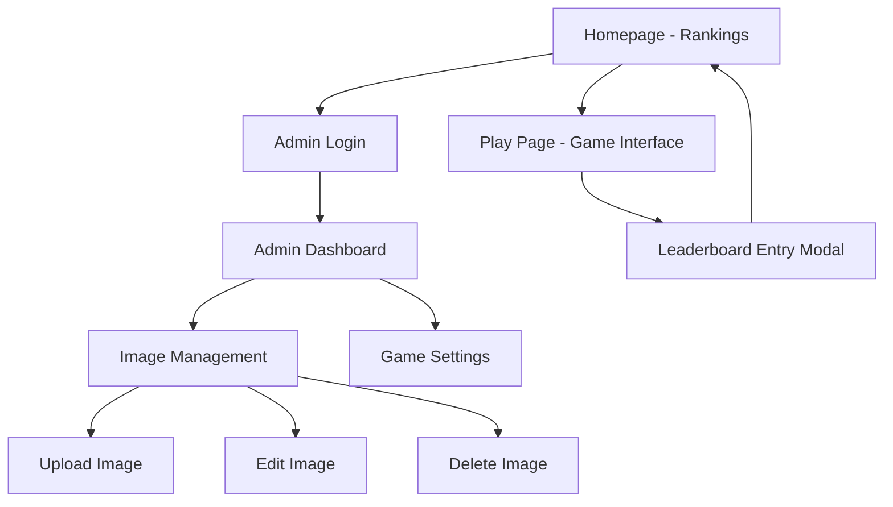
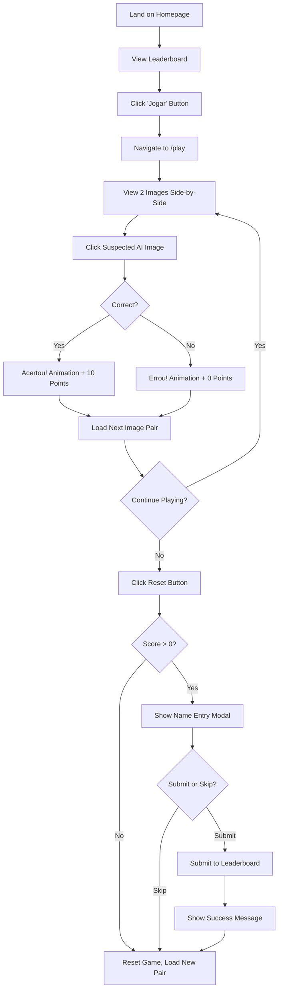
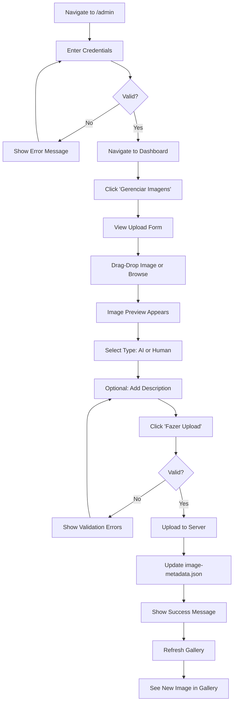
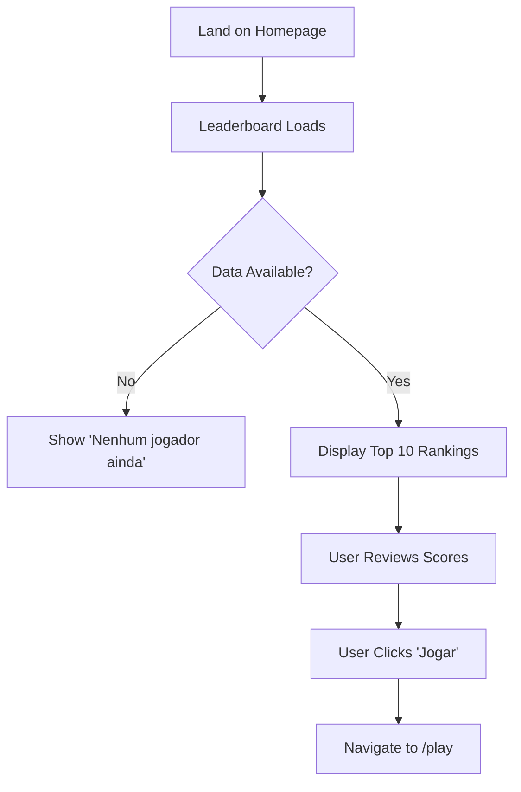

# AI vs Human Image Challenge - UI/UX Specification

## Introduction

This document defines the user experience goals, information architecture, user flows, and visual design specifications for the AI vs Human Image Challenge user interface. It serves as the foundation for visual design and frontend development, ensuring a cohesive and user-centered experience.

The application features a **liquid glass (glassmorphism)** design aesthetic combined with HackTudo's brand identity, creating a modern, engaging, and visually stunning experience for users testing their ability to distinguish AI-generated images from human-created ones.

### Overall UX Goals & Principles

#### Target User Personas

**Curious Learner**
- Age: 18-45
- Tech-savvy individuals interested in AI technology
- Wants to test their visual perception skills
- Enjoys gamified learning experiences
- Values immediate feedback and progress tracking

**Competitive Player**
- Age: 16-35
- Motivated by leaderboards and high scores
- Enjoys challenging games with clear win conditions
- Shares achievements on social media
- Returns frequently to improve ranking

**Administrator**
- Content curator for HackTudo platform
- Needs efficient tools to manage image repository
- Values clear, functional admin interfaces
- Requires secure authentication and straightforward CRUD operations

#### Usability Goals

1. **Immediate Engagement**: Users can start playing within 5 seconds of landing on homepage
2. **Clear Feedback**: Every interaction provides instant, unambiguous visual feedback
3. **Effortless Navigation**: No more than 2 clicks to reach any major feature
4. **Memorable Experience**: Liquid glass aesthetic and animations create lasting impression
5. **Error Prevention**: Confirmation dialogs for destructive actions (reset, delete)
6. **Performance**: Smooth 60fps animations and sub-2s page loads

#### Design Principles

1. **Liquid Glass First** - Glassmorphism aesthetic defines visual identity: frosted glass cards, subtle transparency, vivid backdrop blur effects
2. **Celebration over Punishment** - Success animations are vibrant and joyful; failures are gentle and encouraging
3. **Progressive Disclosure** - Show only what's needed: game interface is clean, admin tools are organized hierarchically
4. **Accessible Beauty** - Stunning visuals never compromise usability or accessibility (WCAG AA compliance)
5. **Brand Harmony** - HackTudo design tokens integrated seamlessly with liquid glass aesthetic

### Change Log

| Date | Version | Description | Author |
|------|---------|-------------|---------|
| 2025-09-30 | 0.1 | Initial UI/UX specification with liquid glass design | Sally (UX Expert) |

---

## Information Architecture (IA)

### Site Map / Screen Inventory



### Navigation Structure

**Primary Navigation:**
- **Homepage** (`/`): Displays leaderboard/rankings, "Jogar" button to start game
- **Play Page** (`/play`): Game interface with 2-image comparison, history panel, score display
- **Admin** (`/admin`): Protected login page

**Secondary Navigation (Admin Only):**
- **Admin Dashboard** (`/admin/dashboard`): Image management and game settings
- **Logout**: Returns to homepage

**Breadcrumb Strategy:**
- Homepage → Play Page (back button in top-left)
- Admin Dashboard shows current section (e.g., "Dashboard / Gerenciar Imagens")
- No breadcrumbs needed for main game flow (single-level navigation)

---

## User Flows

### Flow 1: New Player Game Experience

**User Goal:** Play the game for the first time, make selections, and submit score to leaderboard

**Entry Points:** Homepage "Jogar" button

**Success Criteria:** User completes game, sees final score, optionally submits name to leaderboard

#### Flow Diagram



#### Edge Cases & Error Handling

- **Insufficient Images**: Display error message "Imagens insuficientes. Entre em contato com administrador." if fewer than 4 images (2 AI, 2 Human)
- **Network Failure**: Show retry button with message "Erro ao carregar imagens. Tente novamente."
- **Image Load Failure**: Display placeholder with error icon and reload option
- **Leaderboard Submit Failure**: Allow retry or skip with message "Erro ao salvar pontuação. Tente novamente?"
- **Accidental Reset Click**: Confirmation dialog prevents accidental game resets

**Notes:** Game continues indefinitely until user clicks reset. Admin can configure total rounds per game in future iteration.

---

### Flow 2: Admin Image Upload

**User Goal:** Upload new images to game repository with metadata

**Entry Points:** Admin dashboard "Gerenciar Imagens" section

**Success Criteria:** Image uploaded successfully, appears in gallery, can be used in game

#### Flow Diagram



#### Edge Cases & Error Handling

- **Invalid File Type**: "Formato inválido. Use PNG, JPG, JPEG, WebP ou GIF."
- **File Too Large**: "Arquivo muito grande. Máximo: 5MB."
- **Dimensions Too Small**: "Imagem muito pequena. Mínimo: 400x400px."
- **Upload Network Failure**: "Erro ao enviar imagem. Tente novamente."
- **Duplicate Filename**: Backend renames with timestamp prefix
- **Session Expired**: Redirect to login with message "Sessão expirada. Faça login novamente."

**Notes:** Drag-drop interface provides visual feedback during drag operation (highlight drop zone, show "Solte aqui" message).

---

### Flow 3: View Rankings on Homepage

**User Goal:** View current leaderboard and decide to play

**Entry Points:** Direct navigation to homepage (`/`)

**Success Criteria:** User sees top 10 players, understands ranking, clicks "Jogar"

#### Flow Diagram



#### Edge Cases & Error Handling

- **Empty Leaderboard**: "Nenhum jogador ainda. Seja o primeiro!"
- **Leaderboard Load Failure**: Show cached data if available, else "Erro ao carregar ranking."
- **Slow Network**: Display skeleton loading state

**Notes:** Leaderboard auto-refreshes every 30 seconds when user submits new score.

---

## Wireframes & Mockups

### Design Files

**Primary Design Files:** Figma mockups to be created based on this specification

**Design Tool Link:** _(To be added after Figma designs are complete)_

---

### Key Screen Layouts

#### Screen 1: Homepage - Rankings

**Purpose:** Welcome users, display leaderboard, provide clear call-to-action to start playing

**Key Elements:**

**Header Section (Liquid Glass Card)**
- HackTudo logo (top-left)
- Page title: "AI vs Human Challenge" (center, large, bold)
- Admin link (top-right, subtle, small text)

**Hero Section (Center)**
- Large frosted glass card with vivid backdrop blur
- Heading: "Descubra se você consegue identificar imagens geradas por IA"
- Subheading: "Teste suas habilidades e entre para o ranking!"
- Large primary button: "Jogar Agora" (glassmorphic button with gradient)

**Leaderboard Section (Right or Below Hero)**
- Glassmorphic card with title "Ranking dos Melhores"
- Top 10 players displayed in clean table:
  - Medal icons for top 3 (🥇🥈🥉)
  - Rank number, player name, score
  - Subtle divider lines between entries
- Empty state: "Nenhum jogador ainda. Seja o primeiro!"

**Footer**
- HackTudo branding
- Links: "Sobre", "Contato", "Privacidade"

**Interaction Notes:**
- Hover on "Jogar Agora" button: Subtle scale (1.05) + glow effect
- Leaderboard auto-scrolls if more than 10 entries (future enhancement)
- Smooth fade-in animation on page load
- Parallax background effect with subtle gradient mesh

**Layout:**
```
┌────────────────────────────────────────────────┐
│  Logo        AI vs Human Challenge      Admin  │
├────────────────────────────────────────────────┤
│                                                │
│        ╔═══════════════════════════╗          │
│        ║   Descubra se você        ║          │
│        ║   consegue identificar... ║          │
│        ║                           ║          │
│        ║    [Jogar Agora]          ║          │
│        ╚═══════════════════════════╝          │
│                                                │
│        ╔═══════════════════════════╗          │
│        ║  Ranking dos Melhores     ║          │
│        ║  ─────────────────────    ║          │
│        ║  🥇 1. Ana Silva - 180    ║          │
│        ║  🥈 2. João Pedro - 150   ║          │
│        ║  🥉 3. Maria Costa - 120  ║          │
│        ║  ...                      ║          │
│        ╚═══════════════════════════╝          │
│                                                │
└────────────────────────────────────────────────┘
```

**Design File Reference:** `Homepage - Rankings.fig` (to be created)

---

#### Screen 2: Play Page - Game Interface

**Purpose:** Core game experience where users compare two images and make selections

**Key Elements:**

**Header (Compact, Liquid Glass)**
- Back button (top-left): "← Voltar"
- Score display (top-center): "Pontos: 40 | Rodada: 5"
- Round counter (top-right): Subtle progress indicator

**Main Game Area (Center)**
- Two large glassmorphic image cards side-by-side
  - Desktop: ~600px width each, 20px gap
  - Mobile: Stacked vertically
- Each image card has:
  - Frosted glass border
  - Subtle shadow with backdrop blur
  - Image with rounded corners (border-radius: 16px)
  - Description below (if available, small italic text)
  - Hover effect: Subtle lift + glow
  - Click effect: Immediate visual lock (brightness change)

**History Panel (Left Sidebar)**
- Glassmorphic sidebar (~280px width)
- Header: "Histórico"
- Scrollable history entries:
  - Mini thumbnails (80px) of both images per round
  - Border on selected image (green if correct, red if incorrect)
  - Round number badge
  - Check/X icon
- Empty state: "Nenhuma seleção ainda. Comece a jogar!"

**Reset Button (Bottom-Right)**
- Floating glassmorphic button
- Icon: ↻ (refresh/reset icon)
- Hover: Rotate animation
- Click: Confirmation dialog

**Feedback Animations (Overlay)**
- **Acertou!**: Green glassmorphic modal with confetti particles, "+10" flying upward
- **Errou!**: Red glassmorphic modal with shake animation, "Try again!" message

**Interaction Notes:**
- Images clickable only when in "ready" state (not during animation)
- Feedback animation duration: 2-3 seconds
- Auto-load next pair after animation completes
- Smooth state transitions using framer-motion
- Prefers-reduced-motion: Disable particle effects, reduce animation intensity

**Layout (Desktop):**
```
┌─────────────────────────────────────────────────────────────┐
│  ← Voltar         Pontos: 40 | Rodada: 5          Progress  │
├─────────────────────────────────────────────────────────────┤
│                                                             │
│ ┌─────────┐  ┌──────────────┐      ┌──────────────┐       │
│ │Histórico│  │              │      │              │       │
│ │─────────│  │   Image A    │      │   Image B    │       │
│ │         │  │              │      │              │       │
│ │Round 1  │  │              │      │              │       │
│ │ [✓][✗]  │  └──────────────┘      └──────────────┘       │
│ │         │  Description (opt)     Description (opt)      │
│ │Round 2  │                                               │
│ │ [✓][✗]  │                                               │
│ │         │                                               │
│ │...      │                                               │
│ └─────────┘                                               │
│                                                 [Reset ↻]  │
└─────────────────────────────────────────────────────────────┘
```

**Design File Reference:** `Play Page - Game Interface.fig` (to be created)

---

#### Screen 3: Leaderboard Entry Modal

**Purpose:** Capture user's name and email after game completion for leaderboard submission

**Key Elements:**

**Modal Overlay**
- Dark backdrop with blur effect (backdrop-filter: blur(10px))
- Glassmorphic modal card (centered, ~500px width, auto height)

**Modal Content**
- Congratulatory heading: "Parabéns! 🎉"
- Score display (large, bold): "Você fez 80 pontos!"
- Leaderboard position (if top 10): "Você está em #7 no ranking!"
- Name input field (required, placeholder: "Seu nome")
- Email input field (optional, placeholder: "Seu email (opcional)")
- Two buttons:
  - Primary: "Enviar" (glassmorphic, gradient)
  - Secondary: "Jogar Novamente" (outline style)

**Interaction Notes:**
- Modal traps focus (keyboard accessibility)
- Escape key closes modal (triggers "Jogar Novamente")
- Name field validation: 1-50 characters
- Email field validation: Valid email format if provided
- Submit button disabled until name field is valid
- Success message appears after submission: "Obrigado! Seu score foi registrado."
- Auto-close modal after 2 seconds on success

**Layout:**
```
┌─────────────────────────────────────┐
│                                     │
│          Parabéns! 🎉               │
│                                     │
│      Você fez 80 pontos!            │
│   Você está em #7 no ranking!       │
│                                     │
│   ┌──────────────────────────────┐  │
│   │ Seu nome                     │  │
│   └──────────────────────────────┘  │
│                                     │
│   ┌──────────────────────────────┐  │
│   │ Seu email (opcional)         │  │
│   └──────────────────────────────┘  │
│                                     │
│   [Enviar]    [Jogar Novamente]     │
│                                     │
└─────────────────────────────────────┘
```

**Design File Reference:** `Leaderboard Entry Modal.fig` (to be created)

---

#### Screen 4: Admin Dashboard - Image Management

**Purpose:** Provide administrators with tools to upload, edit, and delete images

**Key Elements:**

**Header (Liquid Glass)**
- HackTudo logo + "Painel Administrativo"
- Navigation tabs: "Gerenciar Imagens" (active) | "Configurações" (future)
- Logout button (right)

**Upload Section (Top)**
- Large glassmorphic drag-drop zone
  - Dashed border
  - Icon: ☁️ Upload cloud icon
  - Text: "Arraste imagens aqui ou clique para selecionar"
  - File type hint: "PNG, JPG, JPEG, WebP, GIF (max 5MB)"
- Upload form (appears after file selected):
  - Image preview (thumbnail)
  - Radio buttons: "IA Gerada" | "Humana"
  - Description textarea (optional, 500 char max, character counter)
  - "Fazer Upload" button (primary, glassmorphic)

**Image Gallery Section (Below)**
- Glassmorphic container
- Grid layout (4 columns on desktop, 2 on tablet, 1 on mobile)
- Each gallery item card:
  - Image thumbnail (200px, aspect-ratio: 1)
  - Badge overlay: "IA" (blue) or "Humana" (green)
  - Filename (truncated)
  - Description preview (truncated, tooltip on hover)
  - Action buttons: "Editar" (pencil icon) | "Excluir" (trash icon)
- Pagination controls (bottom) if >20 images
- Search/filter bar (top-right): Filter by "Todas" | "IA" | "Humana"

**Edit Modal (Triggered by "Editar")**
- Similar to upload form
- Pre-populated with current values
- Buttons: "Salvar" | "Cancelar"

**Delete Confirmation Dialog**
- Glassmorphic modal
- Warning icon
- Text: "Tem certeza que deseja excluir esta imagem? Esta ação não pode ser desfeita."
- Buttons: "Sim, Excluir" (danger color) | "Cancelar"

**Interaction Notes:**
- Drag-drop zone highlights on drag-over (border glow effect)
- Image preview shows immediately after selection
- Upload progress indicator (if large file)
- Success/error toast notifications (top-right corner)
- Gallery items have hover effect (lift + shadow)
- Edit/Delete actions require confirmation
- Keyboard accessible (tab navigation, enter to activate)

**Layout:**
```
┌───────────────────────────────────────────────────────────┐
│  Logo  Painel Administrativo              [Fazer Logout]  │
│  [Gerenciar Imagens] [Configurações]                      │
├───────────────────────────────────────────────────────────┤
│                                                           │
│  ╔═══════════════════════════════════════════════════╗   │
│  ║  ☁️ Arraste imagens aqui ou clique para selecionar ║   │
│  ║  PNG, JPG, JPEG, WebP, GIF (max 5MB)              ║   │
│  ╚═══════════════════════════════════════════════════╝   │
│                                                           │
│  Galeria de Imagens                    [Filtro: Todas ▼] │
│  ─────────────────────────────────────────────────────    │
│                                                           │
│  ┌─────────┐  ┌─────────┐  ┌─────────┐  ┌─────────┐     │
│  │ [IA]    │  │[Humana] │  │ [IA]    │  │[Humana] │     │
│  │  img1   │  │  img2   │  │  img3   │  │  img4   │     │
│  │ ✏️ 🗑️   │  │ ✏️ 🗑️   │  │ ✏️ 🗑️   │  │ ✏️ 🗑️   │     │
│  └─────────┘  └─────────┘  └─────────┘  └─────────┘     │
│                                                           │
│              [← Anterior] [1] [2] [3] [Próximo →]        │
│                                                           │
└───────────────────────────────────────────────────────────┘
```

**Design File Reference:** `Admin Dashboard - Image Management.fig` (to be created)

---

## Component Library / Design System

### Design System Approach

**Hybrid Approach:** Combine HackTudo's existing design tokens with custom liquid glass (glassmorphism) component library.

**HackTudo Foundation:**
- Color palette (CSS variables from hacktudo.com.br)
- Typography (Arial/Helvetica sans-serif stack)
- Base spacing scale (8px grid system)
- Transition timings (0.2s-0.4s cubic-bezier)

**Custom Liquid Glass Layer:**
- Glassmorphic card components with backdrop-filter
- Gradient overlays and mesh backgrounds
- Enhanced shadow and blur effects
- Frosted glass buttons and form elements

---

### Core Components

#### Component 1: Glassmorphic Card

**Purpose:** Container component for all major content sections, provides signature liquid glass aesthetic

**Variants:**
- **Default**: Subtle transparency (alpha: 0.1-0.2), backdrop blur (10px), border (1px solid rgba(255,255,255,0.2))
- **Elevated**: Stronger blur (20px), shadow (0 8px 32px rgba(0,0,0,0.2)), border glow
- **Interactive**: Hover lift effect, scale (1.02), shadow intensity increase

**States:**
- **Default**: Normal appearance
- **Hover** (interactive variant): Lift + glow
- **Active**: Slight scale down (0.98)
- **Disabled**: Opacity 0.5, no hover effects

**Usage Guidelines:**
- Use for: Hero sections, leaderboard, game image cards, modals, admin panels
- Background: Always use with vibrant gradient backdrop or image for glass effect to be visible
- Padding: Minimum 24px (mobile), 32px (desktop)
- Border-radius: 16px (standard), 24px (large cards)

**CSS Example:**
```css
.glass-card {
  background: rgba(255, 255, 255, 0.1);
  backdrop-filter: blur(10px);
  border: 1px solid rgba(255, 255, 255, 0.2);
  border-radius: 16px;
  box-shadow: 0 8px 32px rgba(0, 0, 0, 0.1);
}

.glass-card-elevated {
  backdrop-filter: blur(20px);
  box-shadow: 0 8px 32px rgba(0, 0, 0, 0.2);
}

.glass-card-interactive:hover {
  transform: translateY(-4px) scale(1.02);
  box-shadow: 0 12px 40px rgba(0, 0, 0, 0.3);
}
```

---

#### Component 2: Glassmorphic Button

**Purpose:** Primary interactive element for CTAs and actions

**Variants:**
- **Primary**: Gradient fill + glass overlay, white text, prominent
- **Secondary**: Glass only (no gradient), colored text, subtle
- **Outline**: Transparent fill, glass border, colored text
- **Danger**: Red gradient for destructive actions

**States:**
- **Default**: Normal appearance
- **Hover**: Scale (1.05), glow effect, gradient shift
- **Active**: Scale (0.95), brightness increase
- **Disabled**: Opacity 0.5, cursor not-allowed, no interactions
- **Loading**: Spinner overlay, disabled state

**Usage Guidelines:**
- Use Primary for main CTAs ("Jogar Agora", "Enviar")
- Use Secondary for supporting actions ("Jogar Novamente", "Cancelar")
- Use Outline for tertiary actions (navigation, filters)
- Use Danger for destructive actions ("Excluir", "Sim, Excluir")
- Minimum touch target: 44x44px
- Padding: 12px 24px (small), 16px 32px (medium), 20px 40px (large)

**CSS Example:**
```css
.glass-button-primary {
  background: linear-gradient(135deg, #667eea 0%, #764ba2 100%);
  background-blend-mode: overlay;
  backdrop-filter: blur(10px);
  border: 1px solid rgba(255, 255, 255, 0.3);
  border-radius: 12px;
  color: white;
  padding: 16px 32px;
  transition: all 0.3s cubic-bezier(0.4, 0, 0.2, 1);
}

.glass-button-primary:hover {
  transform: scale(1.05);
  box-shadow: 0 8px 20px rgba(102, 126, 234, 0.4);
}
```

---

#### Component 3: Image Card (Game)

**Purpose:** Display game images with glassmorphic frame and interaction states

**Variants:**
- **Default**: Glassmorphic border, subtle shadow
- **Hover**: Lift effect, glow
- **Selected**: Locked state, brightness/contrast adjustment
- **Correct**: Green glow, checkmark overlay
- **Incorrect**: Red glow, shake animation

**States:**
- **Ready**: Clickable, hover effect enabled
- **Locked**: During animation, no interactions, cursor wait
- **Correct**: Green glass border glow
- **Incorrect**: Red glass border glow

**Usage Guidelines:**
- Always use with high-quality images (min 400x400px)
- Maintain aspect ratio (object-fit: cover)
- Include loading skeleton while fetching
- Description text (if present) below image, italic, small (14px)
- Accessible: alt text, keyboard focusable

---

#### Component 4: History Entry Card

**Purpose:** Compact display of past game rounds in history panel

**Variants:**
- **Correct**: Green accent border/badge
- **Incorrect**: Red accent border/badge

**States:**
- **Default**: Normal display
- **Hover** (desktop): Show larger preview tooltip

**Usage Guidelines:**
- Thumbnail size: 80px square
- Border on selected image: 2px solid (green or red)
- Badge indicator: Check (✓) or X (✗) icon
- Round number displayed prominently
- Lazy load thumbnails if many entries

---

#### Component 5: Modal/Dialog (Glassmorphic)

**Purpose:** Overlay component for confirmations, forms, and important messages

**Variants:**
- **Standard**: Center-aligned, medium width (500px)
- **Large**: For forms with multiple fields (700px)
- **Alert**: Smaller, for simple confirmations (400px)

**States:**
- **Open**: Visible with backdrop, focus trapped
- **Closing**: Fade-out animation

**Usage Guidelines:**
- Always use dark backdrop (rgba(0,0,0,0.5)) with blur (10px)
- Modal content: Glassmorphic card
- Close button (X) in top-right or Escape key
- Focus trap: Tab cycles within modal
- Smooth enter/exit animations (0.3s)
- Mobile: Full-width, bottom-sheet on small screens

---

#### Component 6: Form Input (Glassmorphic)

**Purpose:** Text inputs, textareas, and form elements with glass aesthetic

**Variants:**
- **Text Input**: Single-line input
- **Textarea**: Multi-line input
- **Radio/Checkbox**: Custom styled with glass effect

**States:**
- **Default**: Glass border, subtle shadow
- **Focus**: Border glow, shadow increase
- **Error**: Red border, error message below
- **Disabled**: Opacity 0.5, no interactions

**Usage Guidelines:**
- Always use with clear labels (above or placeholder)
- Error messages in red, below field
- Character counter for textareas (e.g., "450 / 500")
- Padding: 12px 16px
- Font-size: 16px (prevents zoom on iOS)

---

## Branding & Style Guide

### Visual Identity

**Brand Guidelines:** HackTudo design system + Liquid Glass aesthetic

**Brand Essence:**
- Modern, tech-forward, innovative
- Playful yet professional
- Accessible, inclusive, welcoming
- Visual delight through glassmorphism

---

### Color Palette

| Color Type | Hex Code | Usage |
|------------|----------|-------|
| Primary | `#667eea` | Primary buttons, links, interactive elements |
| Secondary | `#764ba2` | Gradient stops, accent elements |
| Accent | `#f093fb` | Highlights, celebration animations |
| Success | `#00d4aa` | "Acertou!" feedback, correct indicators, checkmarks |
| Warning | `#ffd166` | Caution messages, important notices |
| Error | `#ef476f` | "Errou!" feedback, incorrect indicators, error messages |
| Neutral Dark | `#1a1a2e` | Text, dark mode backgrounds |
| Neutral Light | `#eaeaea` | Light backgrounds, borders |
| Glass White | `rgba(255, 255, 255, 0.1)` | Glassmorphic card backgrounds |
| Glass Border | `rgba(255, 255, 255, 0.2)` | Glass card borders |

**Gradient Mesh Background:**
```css
background: linear-gradient(135deg, #667eea 0%, #764ba2 50%, #f093fb 100%);
```

**Usage Notes:**
- All glassmorphic components use `Glass White` with `backdrop-filter: blur()`
- Success/Error colors at 80% opacity for subtle feedback overlays
- Gradients use Primary → Secondary for buttons and hero sections

---

### Typography

#### Font Families

- **Primary:** Arial, Helvetica, sans-serif (HackTudo standard)
- **Secondary:** N/A (single font family for consistency)
- **Monospace:** 'Courier New', Courier, monospace (for code/admin technical displays)

#### Type Scale

| Element | Size | Weight | Line Height |
|---------|------|--------|-------------|
| H1 | 48px (3rem) | 700 (Bold) | 1.2 |
| H2 | 36px (2.25rem) | 700 (Bold) | 1.3 |
| H3 | 28px (1.75rem) | 600 (Semi-bold) | 1.4 |
| H4 | 24px (1.5rem) | 600 (Semi-bold) | 1.4 |
| Body | 16px (1rem) | 400 (Regular) | 1.6 |
| Small | 14px (0.875rem) | 400 (Regular) | 1.5 |
| Button | 16px (1rem) | 600 (Semi-bold) | 1.2 |
| Caption | 12px (0.75rem) | 400 (Regular) | 1.4 |

**Responsive Type Scale (Mobile):**
- H1: 36px (2.25rem)
- H2: 28px (1.75rem)
- H3: 24px (1.5rem)
- Body: 16px (1rem) - unchanged

---

### Iconography

**Icon Library:** Lucide Icons (https://lucide.dev) or Heroicons (https://heroicons.com)

**Style:** Outlined, stroke-width: 2px, rounded corners

**Usage Guidelines:**
- Icons always paired with text labels (except universal icons: X, ✓, ✗)
- Icon size: 24px (standard), 20px (small), 32px (large)
- Icon color matches text color for consistency
- Interactive icons have hover state (scale 1.1, color shift)

**Common Icons:**
- Upload: ☁️ Cloud with arrow
- Delete: 🗑️ Trash bin
- Edit: ✏️ Pencil
- Check: ✓ Checkmark
- X: ✗ Cross
- Reset: ↻ Circular arrow
- Medal: 🥇🥈🥉 (top 3 rankings)
- Back: ← Left arrow

---

### Spacing & Layout

**Grid System:** 8px base unit grid system

**Spacing Scale:**
- **xs**: 4px (0.25rem)
- **sm**: 8px (0.5rem)
- **md**: 16px (1rem)
- **lg**: 24px (1.5rem)
- **xl**: 32px (2rem)
- **2xl**: 48px (3rem)
- **3xl**: 64px (4rem)

**Container Widths:**
- **Mobile**: 100% (with 16px padding)
- **Tablet**: 720px
- **Desktop**: 1140px
- **Wide**: 1320px

**Component Spacing:**
- Card padding: `lg` (24px) mobile, `xl` (32px) desktop
- Button padding: `md` x `xl` (16px x 32px)
- Section gaps: `2xl` (48px)
- Element gaps within sections: `lg` (24px)

---

## Accessibility Requirements

### Compliance Target

**Standard:** WCAG 2.1 Level AA

**Commitment:** All features accessible to users with disabilities, keyboard-only users, screen reader users, and users with low vision.

---

### Key Requirements

**Visual:**
- **Color contrast ratios:** 4.5:1 for normal text, 3:1 for large text (18px+ bold or 24px+ regular)
- **Focus indicators:** 2px solid outline with 2px offset, high contrast color (Primary blue #667eea)
- **Text sizing:** Minimum 16px for body text, supports browser zoom up to 200%

**Interaction:**
- **Keyboard navigation:** All interactive elements reachable via Tab, activated via Enter/Space
- **Screen reader support:** Semantic HTML, ARIA labels where needed, meaningful alt text for images
- **Touch targets:** Minimum 44x44px for all clickable elements (WCAG AAA)

**Content:**
- **Alternative text:** All images have descriptive alt text; decorative images use empty alt=""
- **Heading structure:** Proper hierarchy (H1 → H2 → H3), no skipped levels
- **Form labels:** All inputs have associated <label> elements or aria-label

---

### Testing Strategy

**Automated Testing:**
- Axe DevTools (Chrome extension) for automated accessibility scans
- Lighthouse Accessibility audit (score target: 95+)
- eslint-plugin-jsx-a11y for React component linting

**Manual Testing:**
- Keyboard-only navigation testing (Tab, Shift+Tab, Enter, Escape)
- Screen reader testing (NVDA on Windows, VoiceOver on Mac/iOS)
- Color contrast verification with WebAIM Contrast Checker
- Zoom testing at 200% and 400% levels

**User Testing:**
- Test with users who rely on assistive technologies
- Gather feedback on usability and navigation clarity

---

## Responsiveness Strategy

### Breakpoints

| Breakpoint | Min Width | Max Width | Target Devices |
|------------|-----------|-----------|----------------|
| Mobile | 320px | 767px | Smartphones (iPhone SE, iPhone 12/13, Android) |
| Tablet | 768px | 1023px | iPads, Android tablets, small laptops |
| Desktop | 1024px | 1439px | Laptops, desktop monitors |
| Wide | 1440px | - | Large desktop monitors, 4K displays |

---

### Adaptation Patterns

**Layout Changes:**
- **Mobile**: Single column layout, stacked images, collapsible history drawer
- **Tablet**: 2-column layout where appropriate, history panel as overlay
- **Desktop**: Multi-column with fixed sidebars (history panel), spacious image cards
- **Wide**: Larger images, more whitespace, max-width containers prevent excessive stretching

**Navigation Changes:**
- **Mobile**: Hamburger menu, bottom-sheet modals
- **Tablet/Desktop**: Horizontal navigation, standard modals

**Content Priority:**
- **Mobile**: Score and round counter combined, hide less critical info
- **Desktop**: All information visible simultaneously

**Interaction Changes:**
- **Mobile**: Touch-optimized (larger tap targets, swipe gestures for history)
- **Desktop**: Hover effects, cursor changes, tooltips

**Specific Adaptations:**

**Play Page (Game Interface):**
- **Mobile**: Images stacked vertically, history accessible via floating button (opens drawer)
- **Tablet**: Images side-by-side (smaller), history as slide-out panel
- **Desktop**: Images large side-by-side, history always visible (fixed sidebar)

**Admin Dashboard:**
- **Mobile**: Upload form full-width, gallery 1-column
- **Tablet**: Gallery 2-column
- **Desktop**: Gallery 4-column, upload form + gallery visible simultaneously

---

## Animation & Micro-interactions

### Motion Principles

1. **Purposeful Motion**: Every animation serves a purpose (feedback, transition, delight)
2. **Natural Physics**: Easing curves mimic real-world acceleration/deceleration
3. **Performance First**: 60fps animations, GPU-accelerated properties (transform, opacity)
4. **Respect Preferences**: Honor `prefers-reduced-motion` for accessibility
5. **Celebration > Punishment**: Success animations are joyful; failure animations are gentle

**Easing Curves:**
- **Ease-out**: Quick start, slow end - Use for entrances (cubic-bezier(0, 0, 0.2, 1))
- **Ease-in**: Slow start, quick end - Use for exits (cubic-bezier(0.4, 0, 1, 1))
- **Ease-in-out**: Slow start and end - Use for transitions (cubic-bezier(0.4, 0, 0.2, 1))
- **Spring**: Bouncy, playful - Use for celebratory animations (use framer-motion spring)

---

### Key Animations

**1. Acertou! Success Animation**
- **Description:** Green glassmorphic overlay fades in, "Acertou!" text scales up with bounce, confetti particles burst from center, "+10" text flies upward with fade-out, selected image pulses with green glow
- **Duration:** 2.5s total (overlay: 0.3s, text: 0.5s, confetti: 2s, glow: 1s)
- **Easing:** Spring (bounce) for text, ease-out for overlay, linear for confetti

**2. Errou! Failure Animation**
- **Description:** Red glassmorphic overlay fades in gently, "Errou!" text appears with subtle shake, selected image shakes horizontally, correct image highlights with green border pulse, sad emoji (😔) displays briefly
- **Duration:** 2s total (overlay: 0.3s, shake: 0.4s, highlight: 0.5s)
- **Easing:** Ease-out for overlay, custom shake keyframes, ease-in-out for highlight

**3. Card Hover (Desktop)**
- **Description:** Image card lifts 4px upward, scale increases to 1.02, shadow intensifies, subtle glow appears around border
- **Duration:** 0.3s
- **Easing:** Ease-out (cubic-bezier(0, 0, 0.2, 1))

**4. Button Hover**
- **Description:** Button scales to 1.05, shadow increases, gradient shifts slightly, glow effect around border
- **Duration:** 0.3s
- **Easing:** Ease-out

**5. Modal Enter/Exit**
- **Description:** Backdrop fades in (opacity 0 → 1), modal scales up from 0.9 to 1 with fade-in; exit reverses animation
- **Duration:** 0.3s enter, 0.2s exit
- **Easing:** Ease-out for enter, ease-in for exit

**6. Page Transition**
- **Description:** Fade-out current page (opacity 1 → 0), fade-in next page (opacity 0 → 1) with slight upward movement (translateY(20px) → 0)
- **Duration:** 0.4s
- **Easing:** Ease-in-out

**7. Score Counter Update**
- **Description:** Number animates from old value to new value (count-up animation), brief scale pulse (1 → 1.1 → 1)
- **Duration:** 0.5s count-up, 0.2s pulse
- **Easing:** Ease-out for count, ease-in-out for pulse

**8. Confetti Particles (Success)**
- **Description:** 50-100 colorful particles burst from center of screen, fall with gravity simulation, fade out
- **Duration:** 2s (fall + fade)
- **Easing:** Linear for fall, ease-out for fade
- **Library:** canvas-confetti or react-confetti

**9. Image Load (Skeleton → Image)**
- **Description:** Skeleton shimmer effect while loading, cross-fade to actual image on load complete
- **Duration:** 0.3s cross-fade
- **Easing:** Ease-in-out

**10. History Entry Add**
- **Description:** New entry slides in from top of history panel with fade-in, existing entries shift down smoothly
- **Duration:** 0.4s
- **Easing:** Ease-out

---

## Performance Considerations

### Performance Goals

- **Page Load:** First Contentful Paint (FCP) < 1.5s, Largest Contentful Paint (LCP) < 2.5s
- **Interaction Response:** Input delay < 100ms, visual feedback within 16ms (60fps)
- **Animation FPS:** Consistent 60fps for all animations, no dropped frames

---

### Design Strategies

**Image Optimization:**
- Use WebP format with JPEG fallback
- Implement responsive images with srcset (multiple resolutions)
- Lazy load off-screen images (history thumbnails, leaderboard avatars)
- Maximum image file size: 5MB (enforced by admin upload validation)
- Server-side image compression on upload (sharp library)

**Code Splitting:**
- Separate bundles for homepage, play page, admin dashboard
- Load admin bundle only when navigating to /admin

**Critical CSS:**
- Inline critical CSS for above-the-fold content
- Defer non-critical stylesheets

**Animation Performance:**
- Use GPU-accelerated properties: transform, opacity (avoid animating width, height, top, left)
- Use will-change CSS hint for frequently animated elements
- Disable complex animations on low-end devices (check performance.memory if available)

**Glassmorphism Optimization:**
- Limit backdrop-filter blur to 10-20px (higher values are expensive)
- Avoid backdrop-filter on many nested elements
- Use CSS containment (contain: layout style paint) for isolated components

**Prefers-Reduced-Motion:**
- Disable/simplify animations for users with motion sensitivity
- Replace confetti with simple fade-in for success feedback
- Reduce animation duration by 50%

**Font Loading:**
- Use system fonts (Arial, Helvetica) - no web font loading overhead
- font-display: swap for any custom fonts (future-proofing)

---

## Next Steps

### Immediate Actions

1. **Create High-Fidelity Mockups in Figma**
   - Homepage with leaderboard
   - Play page with liquid glass image cards and history panel
   - Leaderboard entry modal
   - Admin dashboard with drag-drop upload and gallery

2. **Build Interactive Prototype**
   - Link screens in Figma for user flow demonstration
   - Add hover/click states for interactive elements
   - Include animation previews (Acertou!/Errou!)

3. **Stakeholder Review Session**
   - Present mockups and prototype to HackTudo team
   - Gather feedback on liquid glass aesthetic alignment with brand
   - Validate user flows and interaction patterns

4. **Design Handoff Preparation**
   - Export design tokens (colors, spacing, typography) as JSON/CSS
   - Document component specs in Storybook format (future)
   - Create design system documentation (component usage guidelines)

5. **Accessibility Audit of Designs**
   - Run contrast checker on all color combinations
   - Verify focus indicator visibility on glassmorphic backgrounds
   - Validate keyboard navigation flows

---

### Design Handoff Checklist

- [ ] All user flows documented and approved
- [ ] Component inventory complete with variants and states
- [ ] Accessibility requirements defined (WCAG AA compliance)
- [ ] Responsive strategy clear with breakpoint specifications
- [ ] Brand guidelines incorporated (HackTudo + Liquid Glass)
- [ ] Performance goals established (LCP < 2.5s, 60fps animations)
- [ ] Animation specifications documented with durations and easing
- [ ] High-fidelity mockups created in Figma
- [ ] Interactive prototype demonstrating key user flows
- [ ] Design tokens exported (CSS variables or JSON)
- [ ] Asset library prepared (icons, images, logos)
- [ ] Stakeholder approval obtained

---

## Checklist Results

_(This section will be populated after running a UI/UX checklist to validate the specification completeness and quality.)_

**Note:** Before finalizing this specification, a UX checklist should be executed to verify:
- All screens and components are fully specified
- User flows cover all happy paths and edge cases
- Accessibility requirements are comprehensive and achievable
- Design system is consistent and reusable
- Performance considerations are practical and measurable

---

**End of UI/UX Specification Document**

This document serves as the foundation for frontend development and visual design. All mockups, prototypes, and implementation should reference this specification for consistency and alignment with user experience goals.
